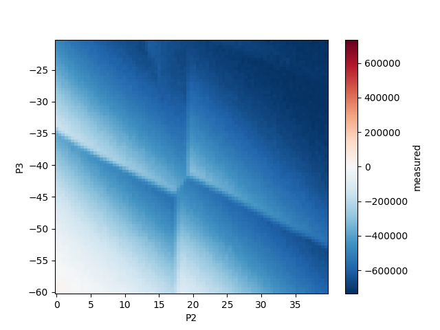

# Quantum Dataset

A collection of measurements on quantum devices.

The data for the QuantumDataset is attached to the github release named `Test`, see
https://github.com/QuTech-Delft/quantum_dataset/releases/tag/Test

## Example usage

```
from quantumdataset import QuantumDataset
quantum_dataset=QuantumDataset(data_directory=None)
quantum_dataset.list_tags()

dataset = quantum_dataset.load_dataset('allxy', 0)
quantum_dataset.plot_dataset(dataset)

quantum_dataset.generate_overview_page(quantum_dataset.data_directory / 'overview')
```


